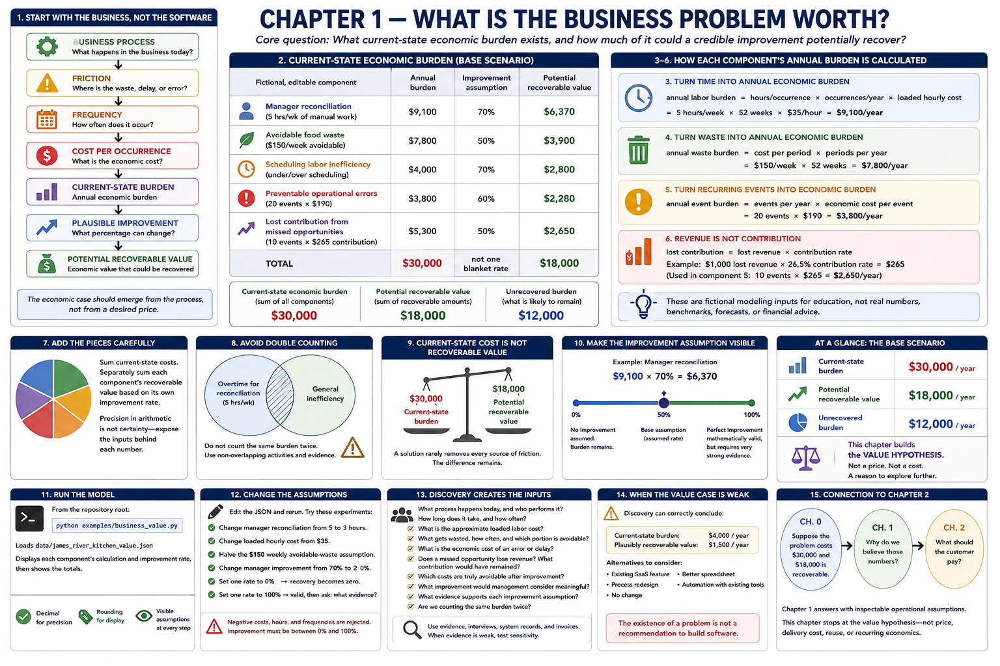

# Chapter 1 — What Is the Business Problem Worth?

[Previous: Chapter 0](00-three-party-deal.md) · [Book home](../README.md) · [Next: Chapter 2](02-customer-pricing.md)



> **Core question:** What current-state economic burden exists, and how much of
> it could a credible improvement potentially recover?

> **Important:** James River Kitchen is fictional. Every restaurant detail,
> amount, frequency, cost, and improvement rate below is an editable educational
> assumption—not real financial data, a benchmark, a forecast, or financial advice.

## 1. Start with the business, not the software

Do not begin with “How much should the software cost?” Begin with “What happens
in the business today, and what economic burden does that create?”

```text
BUSINESS PROCESS → FRICTION → FREQUENCY → COST PER OCCURRENCE
                 → CURRENT-STATE BURDEN → PLAUSIBLE IMPROVEMENT
                 → POTENTIAL RECOVERABLE VALUE
```

The economic case should emerge from the process, not from a desired price.

## 2. Meet the current James River Kitchen problem

The base scenario decomposes Chapter 0's introductory $30,000 assumption:

| Fictional, editable component | Annual burden | Improvement | Recoverable |
|---|---:|---:|---:|
| Manager reconciliation | $9,100 | 70% | $6,370 |
| Avoidable food waste | $7,800 | 50% | $3,900 |
| Scheduling labor inefficiency | $4,000 | 70% | $2,800 |
| Preventable operational errors | $3,800 | 60% | $2,280 |
| Lost contribution from missed opportunities | $5,300 | 50% | $2,650 |
| **Total** | **$30,000** | **not one blanket rate** | **$18,000** |

These categories are intended to be mutually understandable; they are not claims
about any restaurant. A real assessment would replace every input with evidence.

## 3. Turn time into annual economic burden

```text
annual labor burden
= hours per occurrence × occurrences per year × loaded hourly cost
= 5 hours/week × 52 weeks/year × $35/hour
= $9,100/year
```

The $35 loaded hourly cost is a fictional modeling input, not the actual cost of
restaurant management labor. “Loaded” signals that the chosen cost may include
more than wages, but what it includes must be agreed and documented. Only the
five hours associated with the investigated friction belong in this model—not
all manager time.

## 4. Turn waste into annual economic burden

```text
annual waste burden = cost per period × periods per year
                    = $150/week × 52 = $7,800/year
```

This intentionally simple calculation does not model restaurant inventory
accounting. The $150 means an assumed *avoidable* portion, not all food cost.

## 5. Turn recurring events into economic burden

```text
annual event burden = events per year × economic cost per event
                    = 20 events × $190 = $3,800/year
```

The generic event calculation can represent ordering errors, reconciliation
errors, avoidable rush purchases, or missed opportunities. Name the event and
define what its cost includes so another person can challenge the assumption.

## 6. Revenue is not contribution

A missed $1,000 sale does not automatically destroy $1,000 of economic value.
Fulfilling the sale would usually consume variable costs. A simple hypothesis is:

```text
lost contribution = lost revenue × contribution rate
```

The scenario's final component directly supplies assumed **lost contribution per
event**. It does not call gross sales “profit.” If discovery starts with lost
revenue, document and support the contribution rate before adding the result.

## 7. Add the pieces carefully

The assessment sums current-state costs, then separately sums each component's
recoverable value. Precision in arithmetic is not certainty: $9,100 looks exact,
yet depends entirely on 5 hours, 52 occurrences, and $35. Expose those inputs.

Not every unpleasant number is recoverable value. A necessary vendor payment may
be the transfer required to receive a service. Normal labor is not automatically
waste; all food cost is not food waste; all manager time is not inefficient.
Include only the portion connected to the investigated problem and plausibly
avoidable after a change.

## 8. Avoid double counting

Suppose manager overtime already captures five reconciliation hours each week.
Adding those same hours again under “general inefficiency” exaggerates the total.
Correct the model by retaining one clearly named component—or by dividing the
hours into non-overlapping activities with evidence.

Likewise, never add both lost sales and lost contribution for the same missed
order. Lost contribution is the economic interpretation of that revenue event,
not an additional loss. Before summing, ask: **Are we counting the same burden
twice?**

## 9. Current-state cost is not recoverable value

```text
Current-state cost ≠ software value

potential recoverable value
= current-state economic burden × expected improvement
```

A solution rarely removes every source of friction. In the base scenario,
$30,000 is the estimated burden, $18,000 is potentially recoverable, and $12,000
remains. Neither number is a guaranteed software outcome.

## 10. Make the improvement assumption visible

Each component has its own rate rather than a hidden blanket percentage. For
manager reconciliation:

```text
$9,100 × 70% = $6,370
```

The 70% is an assumption. Rates must be from 0% through 100%. At 0%, the burden
still exists but none is expected to be recovered. At 100%, the model assumes the
entire burden is recoverable. That works mathematically, but perfect improvement
is often unrealistic and requires unusually strong evidence in real discovery.

Simple labels such as conservative, base, and optimistic may help discussion,
but labels do not replace support for inputs. This chapter deliberately avoids
probability distributions and forecasting systems.

## 11. Run the model

From the repository root:

```bash
python examples/business_value.py
```

The example loads `data/james_river_kitchen_value.json`, displays each formula's
annual result and visible improvement rate, and then shows:

```text
Current-state economic burden: $30,000.00
Potential recoverable value:   $18,000.00
Unrecovered burden:            $12,000.00
```

Money and rates use `Decimal`; rounding to cents or display percentages is only
a presentation choice.

## 12. Change the assumptions

Edit the human-readable JSON and rerun. Try these experiments:

1. Change manager reconciliation from 5 to 3 hours per occurrence.
2. Change the assumed loaded hourly cost from $35.
3. Halve the $150 weekly avoidable-waste assumption.
4. Change manager improvement from 70% (`0.70`) to 20% (`0.20`).
5. Set one rate to 0%. Its current burden remains; its recovery becomes zero.
6. Set one rate to 100% (`1.00`). Observe the valid arithmetic, then ask what
   evidence could possibly support perfect recovery.

The model rejects negative costs, hours, and frequencies, as well as improvement
below 0% or above 100%.

## 13. Discovery creates the inputs

A credible model requires questions, not invented precision:

- What process happens today, and who performs it?
- How long does it take, and how often does it happen?
- What approximate loaded labor cost is appropriate?
- What gets wasted, how frequently, and which portion is avoidable?
- What is the economic cost of an error? What happens when work is late?
- Does a missed opportunity lose revenue? What contribution would have remained?
- Which costs are truly avoidable, and which remain after software is introduced?
- What improvement would management consider meaningful?
- What evidence supports each improvement assumption?
- Are we counting the same burden twice?

Observed samples, system records, invoices, and interviews can strengthen inputs.
When evidence is weak, say so and test sensitivity instead of hiding uncertainty.

## 14. When the value case is weak

Discovery can correctly conclude:

```text
The problem is real, but not expensive enough to justify custom software.

Current-state burden:         $4,000/year
Plausibly recoverable value:  $1,500/year
```

A substantial custom implementation may make little economic sense in that
case. Alternatives worth considering include an existing SaaS feature, a better
spreadsheet, process redesign, automation with existing tools, or no change.
The existence of a problem is not a recommendation to build software.

## 15. Connection to Chapter 2

Chapter 0 said, “Suppose the problem costs $30,000 and $18,000 is recoverable.”
Chapter 1 asks, “Why do we believe those numbers?” and answers with inspectable
operational assumptions. Chapter 2 asks about price. This chapter deliberately stops at the value
hypothesis rather than mixing in price, delivery cost, reuse, or recurring economics.

[Previous: Chapter 0](00-three-party-deal.md) · [Book home](../README.md) · [Next: Chapter 2](02-customer-pricing.md)
