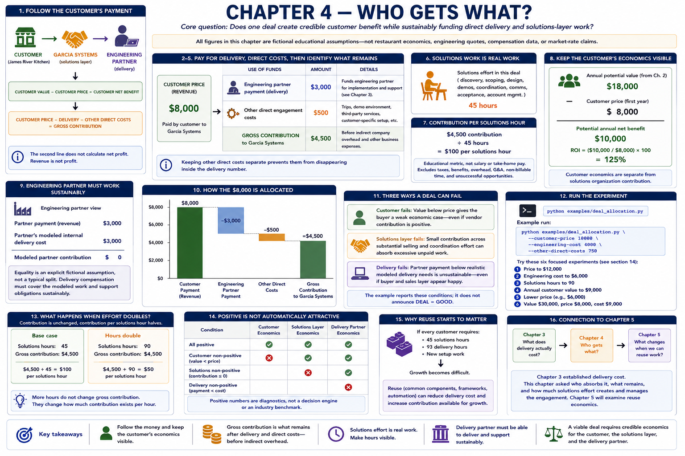

# Chapter 4 — Who Gets What?

[Previous: Chapter 3](03-delivery-cost.md) · [Book home](../README.md) · [Next: Chapter 5](05-reuse-economics.md)



> **Core question:** Does one deal create credible customer benefit while
> sustainably funding direct delivery and solutions-layer work?

All figures in this chapter are fictional educational assumptions—not restaurant
economics, engineering quotes, compensation data, or market-rate claims.

## 1. Follow the customer's payment

The customer pays Garcia Systems; Garcia Systems funds and coordinates an
engineering partner. The payment must be viewed alongside the customer's value:

```text
CUSTOMER VALUE - CUSTOMER PRICE = CUSTOMER NET BENEFIT
CUSTOMER PRICE - DELIVERY - OTHER DIRECT COSTS = GROSS CONTRIBUTION
```

The second line does **not** calculate net profit. Revenue is not profit.

## 2–5. Pay for delivery, direct costs, then identify what remains

The default $8,000 revenue funds a $3,000 engineering-partner payment and $500
of other direct engagement costs. The remaining $4,500 is **gross contribution
before indirect company overhead**. It may still need to compensate prospecting,
discovery, requirements, design, demos, meetings, coordination, acceptance,
customer communication, and account management.

Other direct costs can represent a fictional trip, demo environment, small
third-party service, or customer-specific setup. Keeping them separate prevents
them from disappearing inside the delivery number.

## 6–7. Solutions work is real work

The scenario records 45 hours of solutions effort. Therefore:

```text
$4,500 / 45 hours = $100 per solutions hour
```

This educational metric exposes effort; it is not salary or take-home pay. It
does not include taxes, benefits, indirect overhead, general business expenses,
non-billable company time, or unsuccessful opportunities. If ten discovery
efforts produce two deals, closed-deal hours do not capture the other eight.
Acquisition and pipeline capacity remain outside this chapter.

At 120 hours the same contribution becomes $37.50 per solutions hour. No number
here is a universal acceptable threshold; the useful step is making effort visible.

## 8. Keep the customer's economics visible

Potential annual value remains $18,000. At an $8,000 price, potential annual net
benefit is $10,000 and ROI is 125%. These customer results are separate from the
solutions organization's contribution. Vendor economics cannot prove value.

## 9–10. Engineering must also work sustainably

The partner payment is the engineering partner's revenue; the partner's modeled
internal delivery cost is a different number. The default happens to set both to
$3,000, consistent with Chapter 3's modeled delivery cost. Equality is an explicit
fictional assumption, not a typical split. If payment were $3,500 and internal
cost $3,000, modeled partner contribution would be $500. Without credible cost
information, no partner margin should be invented. Delivery compensation must
cover the modeled work and support obligations sustainably.

## 11. Three ways a deal can fail

1. **Customer fails:** value below price gives the buyer a weak economic case,
   even if the vendor contribution is positive.
2. **Solutions layer fails:** a small contribution spread across substantial
   selling and coordination effort can absorb excessive unpaid work. A positive
   $1 is mathematically positive, not automatically commercially sensible.
3. **Delivery fails:** partner payment below realistic modeled delivery needs is
   unsustainable, even if the buyer and sales layer initially appear satisfied.

The example reports these conditions; it deliberately does not announce
`DEAL = GOOD`. Assumptions and judgment still determine viability.

## 12. Run the experiment

```bash
python examples/deal_allocation.py
python examples/deal_allocation.py \
  --customer-price 10000 \
  --engineering-cost 4000 \
  --other-direct-costs 750
```

Try these six focused experiments:

1. Set price to `$12,000`: customer net benefit falls, solutions contribution
   rises, and engineering cost does not change. Better vendor economics can
   weaken customer economics.
2. Set engineering cost to `$6,000`: contribution falls, while the customer's
   value case does not automatically change.
3. Set `--solutions-hours 90`: contribution is unchanged but contribution per
   hour halves.
4. Set annual customer value to `$9,000`: customer benefit falls while vendor
   contribution stays unchanged.
5. Lower price: the buyer's case improves while contribution available for
   selling and coordination can become very small.
6. Set value to `$30,000`, price to `$8,000`, and engineering cost to `$9,000`:
   the customer can love the price while the vendor/delivery economics fail.

## 13–14. Effort doubles; positive is not automatically attractive

Doubling hours does not alter gross contribution, but it halves effective
contribution per solutions hour. Likewise, the three positive/non-positive
conditions are diagnostics, not a decision engine or an industry benchmark.

## 15–16. Why reuse starts to matter — connection to Chapter 5

Chapter 3 established delivery cost. This chapter asked who absorbs it, what
remains, and how much solutions effort creates and manages the engagement. If
every customer requires 45 solutions hours, 93 delivery hours, and new setup
work, growth may become difficult. Chapter 5 will ask what changes when common
engineering work can be reused; reuse is intentionally not modeled here.

[Previous: Chapter 3](03-delivery-cost.md) · [Book home](../README.md) · [Next: Chapter 5](05-reuse-economics.md)
