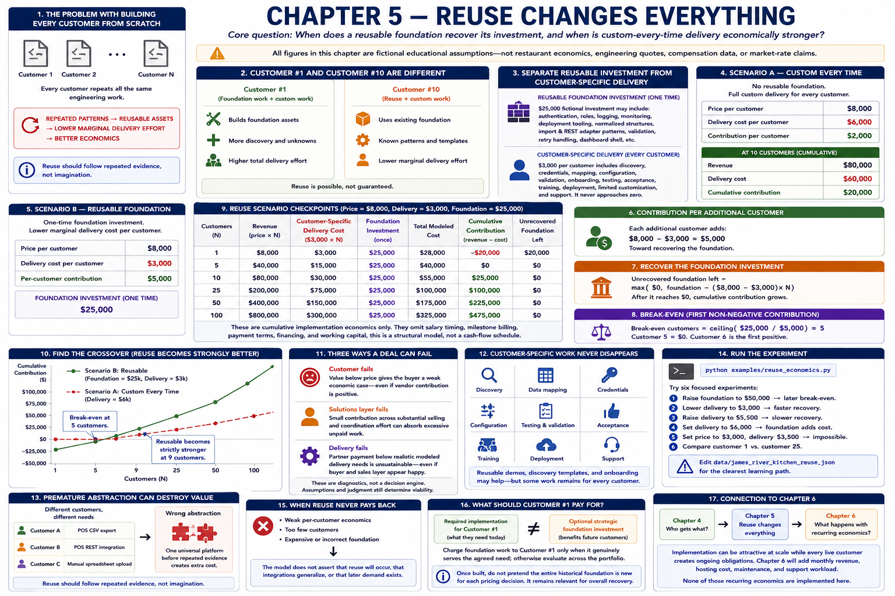

# Chapter 5 — Reuse Changes Everything

[Previous: Chapter 4](04-who-gets-what.md) · [Book home](../README.md) · [Next: Chapter 6](06-recurring-revenue.md)



> **Core question:** When does a reusable foundation recover its investment,
> and when is custom-every-time delivery economically stronger?

## 1. The problem with building every customer from scratch

Chapter 4 combined solutions effort and delivery effort for one engagement. At
multiple customers, the next questions are: **Which engineering tasks truly must
repeat? Which can become repeatable assets?** Building independently every time
keeps delivery simple to explain, but repeats all $6,000 of our fictional custom
delivery cost for every customer.

The alternative is not “build a platform first, then find customers.” It is:

```text
CUSTOMER DISCOVERY → REPEATED PROBLEM PATTERNS → COMMON DELIVERY NEEDS
→ REUSABLE ENGINEERING ASSETS → LOWER MARGINAL DELIVERY EFFORT
→ POTENTIALLY BETTER ECONOMICS
```

Reuse should follow repeated evidence, not imagination.

## 2. Customer #1 and customer #10 are different

Customer #1 may coincide with foundation work, shared engineering assets, and
customer-specific work. Customer #10 may use an existing foundation and
integration patterns, while still needing configuration and limited custom work.
Thus first-customer economics are not later-customer economics—and reuse is
possible, not guaranteed.

## 3. Separate reusable investment from customer-specific delivery

This chapter uses explicit dollar assumptions rather than a magical “reuse
percentage.” The reusable scenario models a fictional $25,000 foundation and
$3,000 delivery per customer. The latter can include discovery, credentials,
mapping, configuration, validation, onboarding, testing, acceptance, training,
deployment, limited customization, and support. It never approaches zero here.

The foundation might represent authentication, accounts and roles, logging,
monitoring, deployment tooling, normalized structures, import and REST adapter
patterns, validation, retry handling, and a dashboard shell. We model only their
economics; we do not build them or claim these amounts are realistic estimates.

## 4. Model the custom-every-time case

Scenario A assumes no foundation, an $8,000 implementation price, and $6,000
delivery per customer. At 10 customers, revenue is $80,000, cost is $60,000, and
cumulative contribution is $20,000.

## 5. Model the reusable-foundation case

Scenario B keeps the fictional $8,000 price, invests $25,000 once, and assumes
$3,000 customer-specific delivery each time. It models a $3,000—or 50%—marginal
delivery-cost reduction relative to Scenario A, not a claim that half of all real
software is reusable.

For `N` customers:

```text
revenue = price × N
customer-specific delivery cost = delivery cost/customer × N
total modeled cost = foundation + customer-specific delivery cost
cumulative contribution = revenue - total modeled cost
```

“Contribution” here is before other overhead. It is not net profit.

## 6. Contribution per additional customer

Before foundation recovery, each additional reusable-scenario customer provides
`$8,000 - $3,000 = $5,000`. That does not say the implementation costs nothing;
it explicitly preserves $3,000 of marginal work.

## 7. Recover the foundation investment

Unrecovered foundation is displayed as:

```text
max($0, foundation - (price - marginal delivery cost) × N)
```

After it reaches zero, cumulative contribution shows how much implementation
contribution remains after recovery.

## 8. Calculate break-even

Break-even means the **first integer customer count where cumulative contribution
is greater than or equal to zero**. We take the ceiling of foundation investment
divided by positive per-customer contribution. Here `$25,000 / $5,000 = 5`, so
customer 5 reaches exactly zero; customer 6 is the first to produce positive
cumulative contribution.

If price is less than or equal to marginal cost, another customer contributes
nothing toward—or moves farther from—recovery. The program reports “no break-even
under modeled assumptions” rather than dividing by zero.

## 9. Compare the checkpoints

| Customers | Reuse revenue | Reuse delivery | Foundation | Total cost | Reuse contribution | Foundation left |
|---:|---:|---:|---:|---:|---:|---:|
| 1 | $8,000 | $3,000 | $25,000 | $28,000 | -$20,000 | $20,000 |
| 5 | $40,000 | $15,000 | $25,000 | $40,000 | $0 | $0 |
| 10 | $80,000 | $30,000 | $25,000 | $55,000 | $25,000 | $0 |
| 25 | $200,000 | $75,000 | $25,000 | $100,000 | $100,000 | $0 |
| 50 | $400,000 | $150,000 | $25,000 | $175,000 | $225,000 | $0 |
| 100 | $800,000 | $300,000 | $25,000 | $325,000 | $475,000 | $0 |

These are cumulative implementation economics only. They omit salary timing,
milestone billing, payment terms, financing, and working capital; this is a
structural model, not a cash-flow schedule.

## 10. Find the crossover

At customer 1, custom-every-time contribution is $2,000 versus -$20,000 for
reuse. At customer 25 it is $50,000 versus $100,000. The reusable scenario first
becomes **strictly** stronger at customer 9: its marginal advantage has finally
exceeded the foundation cost. A tie would not count as this strict crossover.

## 11. Reuse is not free

Reusable engineering needs deliberate architecture, generalized validation,
configuration, documentation, migration compatibility, upgrade planning,
regression tests, shared infrastructure, and multiple-variant support. It is not
the first customer's code copied repeatedly, and platform investment is not
always preferable.

## 12. Customer-specific work never disappears

Discovery, data mapping, credentials, configuration, testing, acceptance,
training, deployment, and support can remain for every customer. Reusable demos,
discovery templates, and onboarding may later help too, but the executable model
stays focused on engineering foundation and marginal delivery.

## 13. Premature abstraction can destroy value

Customer A may need one POS CSV export, B a different POS REST integration, and C
a manual spreadsheet upload. Calling these one universal integration platform
before repeated discovery can produce the wrong abstraction and extra cost.

> **Reuse should follow repeated evidence, not imagination.**

## 14. Run the experiment

```bash
python examples/reuse_economics.py
python examples/reuse_economics.py \
  --foundation-investment 40000 \
  --price-per-customer 9000 \
  --delivery-cost-per-customer 3500
```

Try six edits or overrides:

1. Raise foundation investment from $25,000 to $50,000; observe later break-even.
2. Lower reuse delivery from $3,000 to $2,000; observe faster recovery.
3. Raise it to $5,500; observe slower recovery.
4. Set it to the custom scenario's $6,000; the foundation adds cost without a
   marginal advantage.
5. Set price to $3,000 and delivery to $3,500; observe impossible break-even.
6. Compare customer 1 with customer 25; see early pain and possible later benefit.

Editing `data/james_river_kitchen_reuse.json` remains the clearest learning path.

## 15. When reuse never pays back

Weak per-customer economics, too few customers, or an expensive or incorrect
foundation can prevent recovery. The model does not assert that reuse will occur,
that integrations generalize, or that later demand exists.

## 16. What should customer #1 pay for?

Customer #1's required implementation and Garcia Systems' optional strategic
investment in reusable assets are not necessarily the same economic object. Do
not automatically make customer #1 unknowingly subsidize future customers. Charge
foundation work to that customer only when it genuinely serves the agreed need;
otherwise evaluate the extra investment across the intended portfolio.

Once built, do not pretend the entire historical foundation is newly incurred for
each pricing decision. It remains relevant, however, when asking whether the
overall reusable model has recovered its cost. This is a light sunk-cost
distinction, not advanced cost accounting.

## 17. Connection to Chapter 6

Implementation can become attractive at scale while every live customer creates
ongoing obligations. Chapter 6 will ask what happens when each customer also
generates monthly revenue, hosting cost, maintenance, and support workload. None
of those recurring economics are implemented here.

[Previous: Chapter 4](04-who-gets-what.md) · [Book home](../README.md) · [Next: Chapter 6](06-recurring-revenue.md)
