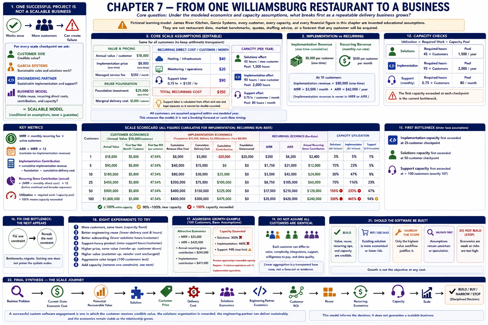

# Chapter 7 — From One Williamsburg Restaurant to a Business

[Previous: Chapter 6](06-recurring-revenue.md) · [Book home](../README.md)



> **Core question:** Under the modeled economics and capacity assumptions, what
> breaks first as a repeatable delivery business grows?

> **Fictional learning model:** James River Kitchen, Garcia Systems, every customer,
> every capacity, and every financial figure in this chapter are invented educational
> assumptions. They are not restaurant data, market benchmarks, quotes, staffing
> advice, or a forecast that any customer will be acquired.

## 1. One successful project is not a scalable business

A working deployment proves that software can work once. It does not prove that
sales, discovery, implementation, support, or marginal economics remain workable.

```text
MORE CUSTOMERS ≠ SCALABLE BUSINESS
```

More demand without executable delivery can create failure rather than success.
This capstone therefore does not merely multiply revenue. At every checkpoint it asks:

```text
CUSTOMER SIDE: credible value?
    +
GARCIA SYSTEMS: sustainable sales and solutions work?
    +
ENGINEERING PARTNER: sustainable implementation and support?
    +
BUSINESS MODEL: viable reuse, recurring direct costs, contribution, and capacity?
    =
SCALABLE MODEL — conditional on the assumptions, never a universal verdict
```

## 2. Revisit James River Kitchen

The fictional progression is James River Kitchen, five Williamsburg restaurants,
then 10, 25, 50, and 100 customers. It is a sequence for asking what would have to
be true, not a claim that demand or geographic expansion exists. Reusable software
does not create demand by itself. Lead generation, trust, discovery, demonstrations,
proposals, procurement, and sales-cycle length can limit growth before code does.

## 3. Define the scale assumptions

Run the standalone assumptions in `data/james_river_kitchen_scaling.json`:

```bash
python examples/scaling_capstone.py
```

The reusable base assumes $18,000 annual value/customer, $8,000 implementation
price, $25,000 foundation investment, $3,000 marginal delivery cost, and a $350
monthly managed service. Monthly recurring direct cost/customer is $40 hosting +
$20 monitoring + 0.75 support hour × $120 = $150. Capacity is 45 solutions hours
and 93 implementation hours per new customer, against 1,500 solutions and 2,000
implementation hours/year; support capacity is 80 hours/month.

All customers are treated as acquired within one modeled year. This reveals pressure;
it is not month-by-month bookings, pipeline, staffing, or cash-flow timing. The 93
implementation hours include Chapter 3's engineering, QA, and deployment effort;
QA is therefore included, not separately double-counted. Support is a separate
monthly workload.

The base also assumes identical customers solely to make the arithmetic transparent:

```text
annual modeled value = $18,000 × customers
```

That multiplication is not evidence about real restaurants. As layers accumulate,
the model becomes more assumption-sensitive. `$487,250` is not more credible merely
because it has more digits.

## 4. One customer

One customer validates whether the problem and solution matter. Modeled annual
value is $18,000; first-year customer cost is $8,000 + $4,200 = $12,200, leaving
$5,800 net benefit and representative first-year ROI of 47.54%. Implementation
contribution is negative $20,000 because one $5,000 marginal contribution has not
recovered the $25,000 foundation. MRR is $350 and annual recurring gross
contribution is $2,400. Capacity is comfortable, but capacity alone cannot repair
unrecovered investment.

## 5. Five customers

Five fictional customers are a chance to look for repeated workflows. Aggregate
modeled value is $90,000. Cumulative implementation revenue is $40,000 and the
foundation is just recovered: $40,000 − $25,000 − $15,000 = $0 contribution.
MRR is $1,750 and annual recurring gross contribution is $12,000. This is a
structural break-even calculation, not a cash-timing forecast.

## 6. Ten customers

Ten customers test whether delivery is repeatable. Modeled value is $180,000,
cumulative implementation contribution is $25,000, MRR is $3,500, ARR is $42,000,
and annual recurring contribution is $24,000. Solutions requires 450 hours and
implementation 930 hours. Custom-every-time would require 1,600 implementation
hours and produce only $20,000 cumulative implementation contribution.

## 7. Twenty-five customers

At 25 customers, aggregate modeled value is $450,000, implementation contribution
is $100,000, MRR is $8,750, ARR is $105,000, and annual recurring contribution is
$60,000. Yet implementation requires 2,325 hours against 2,000. The financial model
remains positive while implementation capacity fails. The next modeled problem is
capacity, not automatically price.

## 8. Fifty customers

At 50 customers, recurring revenue and platform economics are substantial, but
capacity becomes organizational: 2,250 solutions hours exceed 1,500, and 4,650
implementation hours exceed 2,000. Monthly support is still only 37.5 of 80 hours.
Different constraints do not necessarily fail together.

## 9. One hundred customers

At 100 customers, cumulative implementation revenue is $800,000, MRR is $35,000,
and ARR is $420,000. Those impressive revenue figures coexist with 4,500 solutions
hours and 9,300 implementation hours—both far beyond the original pools. Monthly
support is 75 hours, close to but not above 80.

```text
REVENUE OPPORTUNITY ≠ EXECUTABLE CAPACITY
```

The model would require three full solutions-capacity equivalents and five full
implementation-capacity equivalents (ceiling behavior). These are not automatically
employees: capacity could come from contractors, partners, automation, less scope,
or better reuse.

## 10. Implementation economics at scale

Chapter 7 delegates implementation calculations to Chapter 5's `ReuseScenario`:

```text
cumulative implementation contribution
= cumulative implementation revenue
− one-time foundation investment
− cumulative customer-specific delivery cost
```

“Cumulative” matters. It is not annual profit or cash on hand. The platform is
recovered at customer 5 under the fictional reusable assumptions. Custom every
time has no foundation cost, helping early economics, but its $6,000 marginal cost
and 160 hours/customer weaken later economics.

Strong capacity can still accompany weak economics. If price is $5,500 and marginal
delivery cost is $6,000, unused engineering hours do not make the negative
per-customer implementation contribution attractive.

## 11. Recurring economics at scale

Chapter 7 delegates MRR, direct costs, contribution, and support calculations to
Chapter 6's `RecurringScenario`:

```text
ARR = MRR × 12
annual recurring gross contribution
= (MRR − monthly direct recurring cost) × 12
```

Implementation revenue is never included in ARR. Cumulative implementation
contribution is not silently added to an annual run rate. Contribution is before
indirect overhead and broader expenses; it is not net income.

## 12. Solutions-engineering capacity

The 45 hours/customer include prospecting, discovery, requirements, design,
demonstrations, communication, coordination, acceptance, and onboarding/account
transition. Required cumulative acquisition/onboarding work is:

```text
45 hours/customer × new customers in the modeled year
```

Utilization is required hours ÷ 1,500 fictional annual hours. The pool is first
exceeded at the listed 50-customer checkpoint (the exact mathematical limit is
33 whole customers). The 1,500 figure is not a real work-year benchmark.

## 13. Engineering delivery capacity

Implementation workload is 93 hours/customer, separate from its $3,000 cost.
Cost and hours answer different questions. Utilization is required implementation
hours ÷ 2,000 fictional annual hours. It first exceeds capacity at the listed
25-customer checkpoint (21 whole customers fit at the assumed average).

## 14. Support capacity

Support grows at 0.75 hour/customer/month and is compared with 80 hours/month.
All listed checkpoints remain within capacity; 106 whole customers fit and customer
107 is the first exact exceedance. Incident spikes and heterogeneous customers can
invalidate this smooth average.

## 15. Find the first bottleneck

At each configured checkpoint, the executable model reports all exceeded capacity
constraints. It also scans checkpoints in order, preserving ties. Under the default:

```text
implementation first exceeded: 25-customer checkpoint
solutions first exceeded:       50-customer checkpoint
support first exceeded:         not among listed checkpoints (exactly 107)
first modeled bottleneck:        implementation capacity at 25
```

These are conditional outputs from fictional inputs, not business forecasts.
Foundation recovery, negative recurring contribution, or weak customer economics
are also warning conditions, but they should not be mislabeled as hourly capacity.

## 16. Fix one bottleneck and reveal the next

Bottlenecks migrate. Better engineering reuse may make discovery limiting. More
solutions capacity may reveal support. Improving support may reveal acquisition.
Fixing one constraint does not prove the system scales.

## 17. Compare custom-every-time with reuse

The executable comparison keeps three views compact:

- **Scenario A — Custom Every Time:** no foundation, $8,000 price, $6,000 marginal
  cost, and 160 implementation hours/customer. Early investment is lower, but
  marginal economics and delivery load are weaker.
- **Scenario B — Reusable Delivery Platform:** $25,000 foundation, $8,000 price,
  $3,000 marginal cost, 93 hours/customer, plus the managed service. Its stronger
  later economics remain conditional on sales, implementation, and support capacity.
- **Scenario C — Aggressive Growth:** Scenario B at 100 customers without magically
  increasing capacity. Attractive revenue coexists with exceeded solutions and
  implementation pools.

Vendor economics cannot stand alone. Raising implementation price to $16,000 while
value stays $18,000 makes vendor contribution stronger but first-year customer cost
$20,200, producing negative customer net benefit. A strong vendor result with weak
customer ROI breaks the three-party logic.

## 18. Test aggressive growth

A 100-customer target under capacity designed around roughly 21–33 new customers
makes failure visible without building a CRM or forecast. It says what current
capacity could not execute; it does not estimate close rate, bookings, or likelihood.

Useful CLI overrides are intentionally small:

```bash
python examples/scaling_capstone.py \
  --solutions-capacity 2000 \
  --engineering-capacity 3000 \
  --support-capacity 120
```

## 19. Why identical-customer assumptions are dangerous

```text
100 customers ≠ 100 identical businesses
```

Real customers vary in value, complexity, support, integrations, willingness to pay,
and data quality. Linear aggregation is a transparent base case, not a simulation
and not evidence. Investigate variation before committing resources.

## 20. Williamsburg is a starting point, not proof of expansion

Moving beyond fictional Williamsburg adds uncertain customer types, relationships,
POS vendors and integrations, travel, sales channels, competition, and support
expectations. Geography is outside this model. Local learning does not establish
regional or national demand.

## 21. Should the software actually be built?

Do not ask for one magical `BUSINESS = GOOD` output. Read a conditional scorecard:

```text
CUSTOMER ECONOMICS:       positive under the base assumptions
IMPLEMENTATION ECONOMICS: foundation recovered at customer 5
RECURRING ECONOMICS:      positive under the base assumptions
SOLUTIONS CAPACITY:       exceeded at the 50-customer checkpoint
DELIVERY CAPACITY:        exceeded at the 25-customer checkpoint
SUPPORT CAPACITY:         within all listed checkpoints
```

Then apply disciplined judgment: **BUILD** if value, economics, reuse, recurring
operations, and capacity are credible; **BUY / USE SAAS** if existing software is
more economical; **NARROW THE SCOPE** if only one workflow carries enough value;
**DO NOT BUILD** if economics are weak; or **VALIDATE FIRST** if reuse or demand
assumptions remain speculative. Growth is not the objective at any cost.

### Eight experiments

1. **More customers, same team:** keep capacity fixed and find the first break.
2. **Better engineering reuse:** lower marginal cost and hours/customer; watch
   contribution, delivery utilization, and foundation recovery separately.
3. **Better onboarding:** lower solutions hours/customer; observe how many customers
   one solutions-capacity equivalent supports. Reuse includes process, not only code.
4. **Support-heavy product:** increase support hours/customer and locate the new break.
5. **Higher price, same value:** vendor contribution improves while customer economics weaken.
6. **Higher value:** customer economics improve while vendor cost and capacity do not change.
7. **Aggressive sales target:** run 100 customers with capacity designed for about 25.
8. **Add capacity:** remove one constraint and observe which becomes visible next.

## 22. Final synthesis

```text
BUSINESS PROBLEM
        ↓
CURRENT-STATE ECONOMIC COST
        ↓
POTENTIAL RECOVERABLE VALUE
        ↓
SOLUTION
        ↓
CUSTOMER PRICE
        ↓
DELIVERY COST
        ↓
SOLUTIONS ECONOMICS
        ↓
ENGINEERING PARTNER ECONOMICS
        ↓
CUSTOMER ROI
        ↓
REUSE
        ↓
RECURRING ECONOMICS
        ↓
CAPACITY
        ↓
SCALE
        ↓
BUILD / BUY / NARROW / STOP
```

A successful custom software engagement is not merely software that works. It is a
business arrangement in which the customer receives credible value, the solutions
organization is rewarded for creating and managing the opportunity, the engineering
organization can deliver sustainably, and the economics remain viable as the
relationship grows.

That evidence can support **BUILD, BUY, NARROW, VALIDATE, or STOP**; it does not
guarantee a scalable business. This is the end of the eight-chapter sequence.

[Previous: Chapter 6](06-recurring-revenue.md) · [Book home](../README.md)
